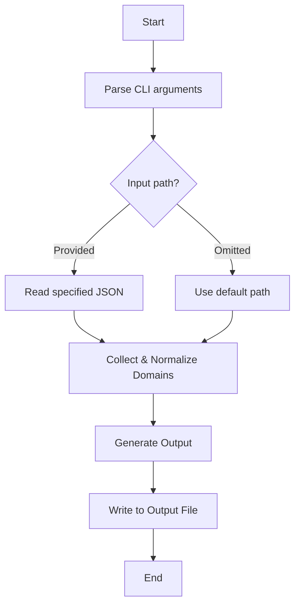

[English](README.md) | [中文](README_zh.md)

[](https://github.com/lazebird/tvconfig_formatter-action/actions/workflows/test.yml)

# tvconfig_formatter-action

A tool that extracts all domains from a tvconfig JSON and generates a configuration file in either Clash/OpenClash rule provider format or Omnibox format.

## Features

- Extracts domains from `api` and `detail` fields within a tvconfig JSON.
- Generates configuration files in two formats:
  - **Clash/OpenClash**: A YAML file with `behavior: domain` for use as a rule provider.
  - **Omnibox**: A JSON file for use with the Omnibox browser extension.
- Normalizes domains by lowercasing, trimming whitespace, and filtering IPv4 addresses.
- Derives base domains (e.g., `api.example.com` → `example.com`).
- Strips common prefixes (`api.`, `collect.`, `m3u8.`, `cj.`, `caiji.`).
- Automatically adds a `+.` prefix to short domains to cover subdomains in Clash format.
- Ensures deterministic output by sorting domains alphabetically.

## Usage

### GitHub Actions

Use this Action from the Marketplace to generate configuration files in your workflow. You can generate both formats in a single job.

```yaml
name: Generate Configuration Files
on:
  workflow_dispatch:

jobs:
  build:
    runs-on: ubuntu-latest
    steps:
      - name: Checkout
        uses: actions/checkout@v4

      - name: Generate Clash rule provider
        uses: lazebird/tvconfig_formatter-action@main
        with:
          config_path: path/to/tvconfig.json
          output_path: path/to/output/site.yaml
          format: clash

      - name: Generate Omnibox configuration
        uses: lazebird/tvconfig_formatter-action@main
        with:
          config_path: path/to/tvconfig.json
          output_path: path/to/output/omnibox.json
          format: omnibox

      - name: Upload generated artifacts
        uses: actions/upload-artifact@v4
        with:
          name: generated-configs
          path: path/to/output/
```

### Standalone Script

1.  **Prerequisites**: Node.js (LTS recommended).
2.  **Clone the repository**: `git clone https://github.com/lazebird/tvconfig_formatter-action.git`
3.  **Run the script**:

    - **For Clash format (default):**
      ```bash
      node src/main.js [input_json_path] -o [output_yaml_path]
      ```

    - **For Omnibox format:**
      ```bash
      node src/main.js [input_json_path] -o [output_json_path] -f omnibox
      ```

## Input/Output Example

**Input (e.g., `tvconfig.json`)**:
```json
{
  "api_site": {
    "siteKey1": { "name": "Site 1", "api": "https://api.example.com/xxx", "detail": "https://www.example.com/yyy" },
    "siteKey2": { "name": "Site 2", "api": "http://collect.foo.bar/api", "detail": "http://foo.bar" }
  }
}
```

**Output (Clash format, e.g., `site.yml`)**:
```yaml
behavior: domain
payload:
  - +.example.com
  - foo.bar
  - api.example.com
```

**Output (Omnibox format, e.g., `omnibox.json`)**:

```json
{
  "sites": [
    {
      "key": "siteKey1",
      "name": "Site 1",
      "api": "https://api.example.com/xxx"
    },
    {
      "key": "siteKey2",
      "name": "Site 2",
      "api": "http://collect.foo.bar/api"
    }
  ]
}
```

## Implementation Details

### Data Flow


### Key Rules
- **URL Parsing**: Uses the native Node.js `URL` class. Invalid URLs are ignored.
- **Domain Canonicalization**: (Clash format only)
  - A base domain is derived by keeping the last two labels (e.g., `sub.example.com` → `example.com`). This is a heuristic and may not be perfect for multi-part TLDs like `.co.uk`.
  - Common prefixes (`api.`, `collect.`, `m3u8.`, `cj.`, `caiji.`) are stripped, and the resulting domain is also added.
- **Filtering**: Pure IPv4 addresses are excluded.
- **Output Stability**: Domains are sorted alphabetically.

## Contributing

Contributions are welcome! Please feel free to submit a pull request or open an issue.

## License

This project is open-source and licensed under the terms of the [LICENSE](LICENSE) file.