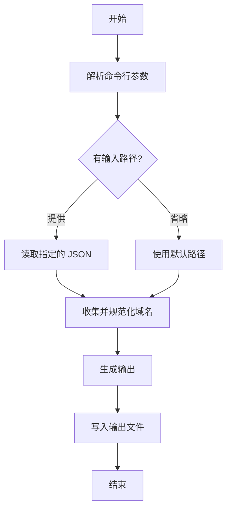

[English](README.md) | [中文](README_zh.md)

[](https://github.com/lazebird/tvconfig_formatter-action/actions/workflows/test.yml)

# tvconfig_formatter-action

一个从 tvconfig JSON 中提取所有域名，并生成 Clash/OpenClash 规则提供者格式或 Omnibox 格式的配置文件的工具。

## 功能

- 从 tvconfig JSON 的 `api` 和 `detail` 字段中提取域名。
- 生成两种格式的配置文件：
  - **Clash/OpenClash**: 一个 `behavior: domain` 的 YAML 文件，用作规则提供者。
  - **Omnibox**: 一个 JSON 文件，用于 Omnibox 浏览器扩展。
- 通过小写转换、去除空格和过滤 IPv4 地址来规范化域名。
- 推导基础域名（例如 `api.example.com` → `example.com`）。
- 剥离常见前缀（`api.`、`collect.`、`m3u8.`、`cj.`、`caiji.`）。
- 在 Clash 格式中自动为短域名添加 `+.` 前缀以覆盖子域名。
- 通过按字母顺序排序域名来确保输出的确定性。

## 如何使用

### GitHub Actions

在您的工作流中使用此 Action 从 Marketplace 生成配置文件。您可以在单个作业中生成两种格式。

```yaml
name: Generate Configuration Files
on:
  workflow_dispatch:

jobs:
  build:
    runs-on: ubuntu-latest
    steps:
      - name: Checkout
        uses: actions/checkout@v4

      - name: Generate Clash rule provider
        uses: lazebird/tvconfig_formatter-action@main
        with:
          config_path: path/to/tvconfig.json
          output_path: path/to/output/site.yaml
          format: clash

      - name: Generate Omnibox configuration
        uses: lazebird/tvconfig_formatter-action@main
        with:
          config_path: path/to/tvconfig.json
          output_path: path/to/output/omnibox.json
          format: omnibox

      - name: Upload generated artifacts
        uses: actions/upload-artifact@v4
        with:
          name: generated-configs
          path: path/to/output/
```

### 独立脚本

1.  **先决条件**: Node.js (推荐 LTS 版本)。
2.  **克隆仓库**: `git clone https://github.com/lazebird/tvconfig_formatter-action.git`
3.  **运行脚本**:

    - **对于 Clash 格式 (默认):**
      ```bash
      node src/main.js [input_json_path] -o [output_yaml_path]
      ```

    - **对于 Omnibox 格式:**
      ```bash
      node src/main.js [input_json_path] -o [output_json_path] -f omnibox
      ```

## 输入/输出示例

**输入 (例如 `tvconfig.json`)**:
```json
{
  "api_site": {
    "siteKey1": { "name": "站点1", "api": "https://api.example.com/xxx", "detail": "https://www.example.com/yyy" },
    "siteKey2": { "name": "站点2", "api": "http://collect.foo.bar/api", "detail": "http://foo.bar" }
  }
}
```

**输出 (Clash 格式, 例如 `site.yml`)**:
```yaml
behavior: domain
payload:
  - +.example.com
  - foo.bar
  - api.example.com
```

**输出 (Omnibox 格式, 例如 `omnibox.json`)**:

```json
{
  "sites": [
    {
      "key": "siteKey1",
      "name": "站点1",
      "api": "https://api.example.com/xxx"
    },
    {
      "key": "siteKey2",
      "name": "站点2",
      "api": "http://collect.foo.bar/api"
    }
  ]
}
```

## 实现细节

### 数据流


### 关键规则
- **URL 解析**: 使用原生的 Node.js `URL` 类。无效的 URL 将被忽略。
- **域名规范化**: (仅限 Clash 格式)
  - 通过保留最后两个标签来派生基础域名（例如 `sub.example.com` → `example.com`）。这是一种启发式方法，对于像 `.co.uk` 这样的多部分顶级域名可能不完美。
  - 常见前缀（`api.`、`collect.`、`m3u8.`、`cj.`、`caiji.`）被剥离，得到的域名也会被添加。
- **过滤**: 纯 IPv4 地址被排除。
- **输出稳定性**: 域名按字母顺序排序。

## 贡献

欢迎贡献！请随时提交拉取请求或开启一个 issue。

## 许可证

本项目是开源的，并根据 [LICENSE](LICENSE) 文件中的条款进行许可。