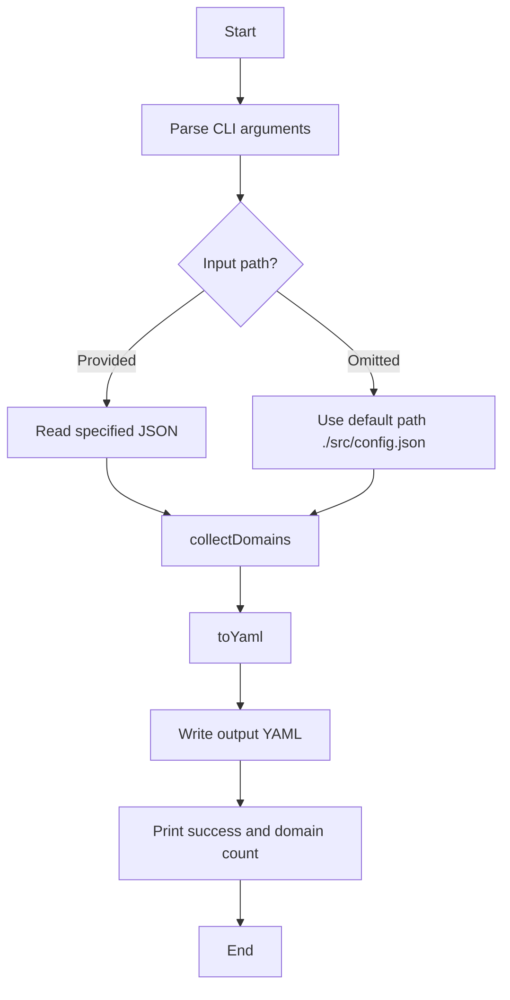

[English](STRUCTURE.md) | [中文](STRUCTURE_zh.md)

# Code Structure and Implementation Notes

This document describes the repository's file organization, key module responsibilities, and data flow to help you quickly understand and extend the project.

## Directory Structure
```
.
├── src/
│   └── main.js    # entry script: read tvconfig, extract domains, generate YAML
├── LICENSE        # license
├── .gitignore     # Git ignore rules
├── action.yml     # Composite Action definition
└── docs/
    └── STRUCTURE_zh.md  # Chinese document
```

## Core File Responsibilities
- `main.js`
  - Argument parsing: supports `<input_json> -o <output_yaml>` and `-h/--help`; defaults are `config.json` and `dist/site.yaml`.
  - Read JSON: `readJSON(filePath)` wraps `fs.readFileSync + JSON.parse`.
  - URL validation and parsing: `isValidUrl` uses `new URL(u)` and extracts the hostname; `extractHostname` lowercases the hostname.
  - Domain canonicalization: `baseDomain(host)` keeps the last two labels as the base domain (heuristic).
  - Domain collection: `collectDomains(config)` iterates `config.api_site`, extracts from `api` and `detail`, strips common prefixes, filters IPv4, and returns a deterministically sorted array.
  - YAML output: `toYaml(domains)` generates a rule provider with `behavior: domain` and automatically adds `+.` for short domains.
  - Main flow: `main()` handles arguments, reads input, assembles domains, writes output, and prints results and counts.

## Data Flow


## Rules and Constraints
- Only recognize objects under `api_site` with fields `api` and `detail`.
- Common prefix stripping list: `api.`, `collect.`, `m3u8.`, `cj.`, `caiji.`.
- IPv4 filter regex: `^\d+\.\d+\.\d+\.\d+$`.
- Stable sorting: compare strings using `a > b ? 1 : a < b ? -1 : 0`.
- YAML safety: remove whitespaces, lowercase, add `+.` for short domains.

## Quality and Security
- Input validation: all URLs are validated via the `URL` class; invalid inputs are ignored.
- Error handling: failures during read/write print errors and exit with non-zero status.
- Reproducibility: sorted output ensures stability, aiding CI diffs.

## Extension Suggestions
- Introduce the Public Suffix List (PSL) to replace the heuristic `baseDomain` and improve accuracy for multi-part TLDs.
- Add configurable prefix stripping (via CLI or JSON settings).
- Support extracting URLs from additional fields or arrays (e.g., mirrors, multi-domain backups).
- Add unit tests and ESLint rules and integrate with CI.
- Publish as an official GitHub Action (keep `action.yml`) and provide `uses:` examples.