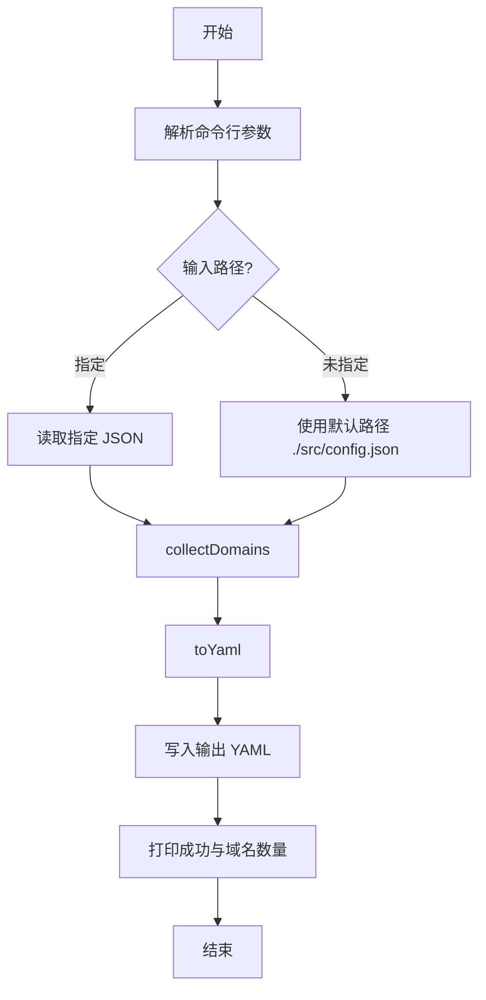

[English](STRUCTURE.md) | [中文](STRUCTURE_zh.md)

# 代码结构与实现说明

本文档描述仓库的文件组织、关键模块职责与数据流，帮助你快速理解与二次开发。

## 目录结构
```
.
├── src/
│   └── main.js    # 入口脚本：读取 tvconfig、提取域名、生成 YAML
├── LICENSE           # 许可证
├── .gitignore        # Git 忽略规则
├── action.yml        # Composite Action 定义
└── docs/
    └── STRUCTURE_zh.md  # 本说明文档（中文）
```

## 核心文件职责
- `main.js`
  - 参数解析：支持 `<input_json> -o <output_yaml>` 与 `-h/--help`；缺省路径为 `config.json` 与 `dist/site.yaml`。
  - 读取 JSON：`readJSON(filePath)` 包装 `fs.readFileSync + JSON.parse`。
  - URL 校验与解析：`isValidUrl` 使用 `new URL(u)` 判断并提取主机；`extractHostname` 获取 hostname 并转小写。
  - 域名归约：`baseDomain(host)` 以最后两段标签作为基础域名（启发式）。
  - 域名收集：`collectDomains(config)` 遍历 `config.api_site`，从 `api` 与 `detail` 两字段抽取，剥离常见前缀，过滤 IPv4，生成稳定排序的数组。
  - YAML 输出：`toYaml(domains)` 生成 `behavior: domain` 的 rule provider，短域自动添加 `+.` 前缀。
  - 主流程：`main()` 负责参数处理、读取输入、组装域名、写入输出，标准输出生成结果与数量。

## 数据流与流程


## 规则与约束
- 仅识别 `api_site` 下的对象条目，字段为 `api` 与 `detail`。
- 常见前缀剥离列表：`api.`、`collect.`、`m3u8.`、`cj.`、`caiji.`。
- IPv4 过滤正则：`^\d+\.\d+\.\d+\.\d+$`。
- 稳定排序：按字符串比较 `a > b ? 1 : a < b ? -1 : 0`。
- YAML 安全：去空白、小写化、短域加 `+.`。

## 质量与安全
- 输入校验：所有 URL 经 `URL` 解析验证，无效输入被忽略。
- 错误处理：读取/写入失败打印错误并以非零状态退出。
- 可重复构建：排序确保输出稳定，便于 CI 工件对比。

## 扩展建议
- 引入公共后缀列表（PSL）以替换启发式 `baseDomain`，提升对多段 TLD 的准确性。
- 增加自定义前缀剥离配置（通过命令行或 JSON 配置）。
- 支持从其他字段或数组中抽取 URL（例如镜像源、多域备用）。
- 增加单元测试与 ESLint 规则，纳入 CI。
- 发布为正式 GitHub Action（保留 `action.yml`），提供 `uses:` 示例。